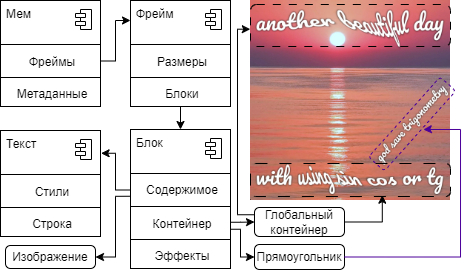

# Memaker

Онлайн-редактор интернет-мемов.

- Стабильную версию можно открыть по адресу: https://robolabgs2.github.io/memaker/
- Самую свежую версию можно увидеть здесь: https://robolabgs2.github.io/memaker-prerelease/

## Разработка

Основной стек: SvelteKit, Typescript, WebGL2.

Установка зависимостей: `npm install`.

Запуск dev сервера:

```bash
npm run dev

# or start the server and open the app in a new browser tab
npm run dev -- --open
```

### Сборка

Сборка осуществляется командой:

```bash
npm run build
```

### CI/CD

Коммиты в main разворачиваются [в GitHub Pages](https://robolabgs2.github.io/memaker-prerelease/) через [репозиторий для пререлизов](https://github.com/RobolabGs2/memaker-prerelease).

При публикации тега вида `v*` разворачивается [релизная версия](https://robolabgs2.github.io/memaker/).

### Архитектура

Структура мема:


